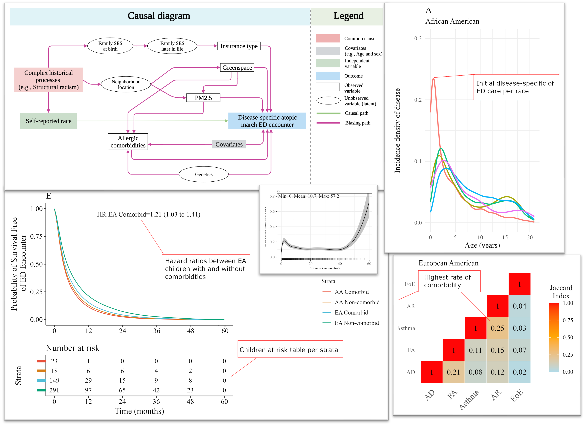

# Description

Briefly, survival Analysis is a branch of statistics that deals with analyzing the expected duration of time until one or more events happen. These events could be death in placebo vs treatment trial, mechanical failure in engines, or departure in customer churn analysis. The name “Survival Analysis” might sound a bit grim, but it’s not always about life and death. It’s about understanding the ‘lifespan’ of a subject in a system. For example, it can be used to predict when a machine part might fail, or how long a user might stay subscribed to a service. Here are some key points to understand about Survival Analysis:

Censoring: One of the unique aspects of Survival Analysis is its ability to handle ‘censoring’. Censoring occurs when we have incomplete information about the time of the event. For example, if we are studying the lifespan of a group of people, some of them might still be alive at the end of the study. Their exact lifespans are unknown or ‘censored’, but Survival Analysis can still use this information.

Survival Function: This function estimates the probability that a subject survives longer than a certain amount of time.

Hazard Function: This function estimates the probability that an event occurs at a certain time, given that the subject has survived up to that time.

Applications: Survival Analysis has wide applications in various fields such as medical research, engineering, economics, social sciences, and even customer analytics in business.

Remember, the goal of Survival Analysis is not just to predict when an event will happen, but to understand the underlying factors that influence the timing of the event. It’s a powerful tool in the statistician’s toolbox, helping us make sense of the complex, uncertain world around us.

We determined the probability of ED encounterfree survival time using hazard ratios (HRs) and time to recurrence (TTR) of ED encounter using Bayesian survival models. This repo covers all code developed for the project:

-Full probabilistic workflow (bayesian) for survival analysis in rstanarm, including recurrent visits (frailty).

-model specification with splines, priors, and validation.

-Fancy visualization from scratch in ggplot.

-Deployment in Shiny (working progress).

# Other sources

-Full manuscript here->[https://doi.org/10.1016/j.jaip.2024.07.009]

-My bayesian survival tutorial in R->[https://maurosc3ner.github.io/bayesian.survival.github.io/]
